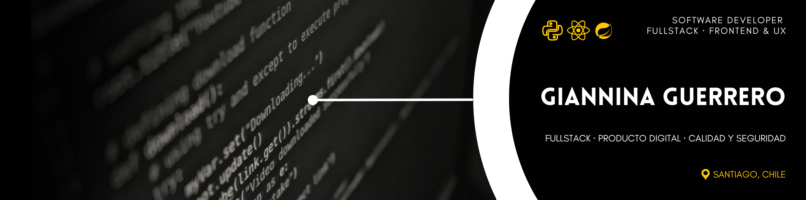

 

 

&nbsp;

&nbsp;

<h3>Software Developer · Fullstack · Frontend & UX</h3>

Analista programadora. Producto digital, interfaz y calidad.

&nbsp;

&nbsp;

&nbsp;&nbsp;

&nbsp;&nbsp;

## Sobre mí

Soy **Giannina Guerrero**, desarrolladora de software en Santiago, Chile. Trabajo en **fullstack y frontend**, con atención a la experiencia de usuario y al producto digital.

Vengo del diseño gráfico y de Ingeniería Informática (Duoc UC). Me interesa que la interfaz se entienda, que el código se pueda mantener y que la entrega cuide calidad y seguridad.

Hoy busco proyectos donde diseño y desarrollo se hablen: pantallas claras, flujos concretos y un stack moderno.

## Stack

<table width="100%">
  <tr>
    <td align="center" valign="top" width="33%">
      
       
      <strong>Lenguajes</strong>  
        
        
      
    </td>
    <td align="center" valign="top" width="34%">
      
       
      <strong>Interfaz</strong>  
        
        
        
      
    </td>
    <td align="center" valign="top" width="33%">
      
       
      <strong>Entorno</strong>  
        
      
    </td>
  </tr>
</table>

## Proyectos destacados

Piezas en preparación. El enlace se activa cuando el repositorio sea público.

<table width="100%">
  <tr>
    <th align="left" width="22%">Proyecto </th>
    <th align="left" width="58%">Foco </th>
    <th align="center" width="20%">Estado </th>
  </tr>
  <tr>
    <td><strong>Kiran</strong></td>
    <td>Lead / frontend. Sistema de interfaz y experiencia de producto.</td>
    <td align="center"><code>Propuesta</code></td>
  </tr>
  <tr>
    <td><strong>Rakin IA</strong></td>
    <td>Flujos e interfaz sobre una capa de inteligencia artificial.</td>
    <td align="center"><code>Propuesta</code></td>
  </tr>
  <tr>
    <td><strong>REV</strong></td>
    <td>Frontend de producto: ritmo visual y componentes.</td>
    <td align="center"><code>Propuesta</code></td>
  </tr>
</table>

## Contacto

**Giannina Guerrero** · Santiago, Chile

[LinkedIn](https://www.linkedin.com/in/ninnaguerrero) · [GitHub](https://github.com/ninnarouge) · [Portafolio](https://giannina-guerrero.netlify.app/)

&nbsp;&nbsp;

&nbsp;&nbsp;

Fullstack · producto digital · calidad y seguridad

